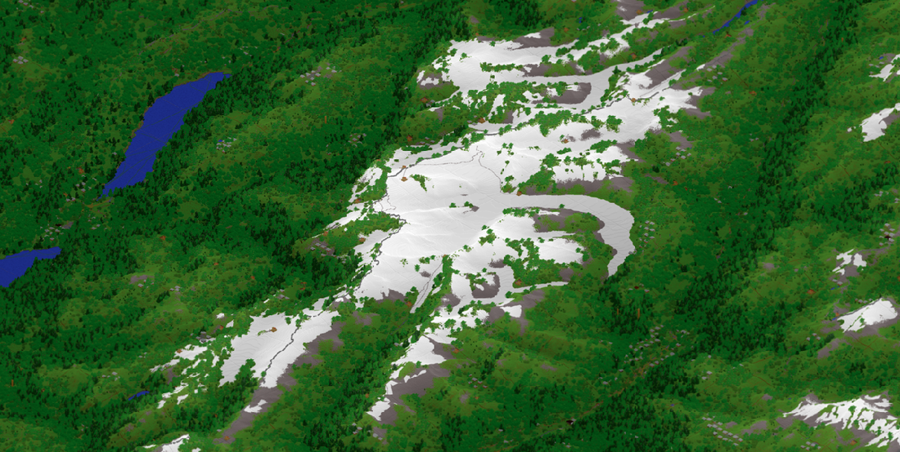

# Chunkmapper



## Compile

```
mvn clean package
```

## Run

```
./run-chunkmapper.sh
./run-chunkmapper.bat
```
depending on your operating System

## Architecture

Chunkmapper generates the real world in Minecraft.  Minecraft is a popular independent game made by Swedish Developer Markus Persson and now bought out by Microsoft.  It is essentially a gigantic virtual lego set made up of elementary building blocks such as dirt, grass, wood, rock, etc.  The world is divided into 'chunks' 256 blocks high and 512 by 512 blocks wide.  Chunkmapper generates the real world in Minecraft by converting satellite and mapping data into these chunks.

Our scale of generation is that one Minecraft block is a degree arc second (30m at the equator).  This is the highest scale that can fit nearly all mountain peaks into 256 vertical blocks.  Because the spherical Earth must be projected onto a rectangular Minecraft grid we choose a cylindrical projection.  At the equator the scale matches Earth perfectly, however the east west direction is stretched by 1 / cosine(latitude) as we move towards the poles.

To start our map we use NASA's SRTM global heightmap.  The SRTM is a radar that was carried on the Space Shuttle in February 2000 to map the world's elevation at 90m resolution.  With this we can build a giant grass plain that includes all the world's hills and valleys.  Ocean floor is currently created as flat, however there are plans to introduce bathymetry in the near future.

Once we have our grassy plain we wish to add more features.  The next layer to add is derived from the satellite data product Globcover.  Globcover integrates various satellite instrument readings to classify the earth's surface into 22 categories such as ice, plains, forest, swamp, urban area etc.  The Globcover source is just a giant png file at 300m resolution.  We categorize every vertical column in Chunkmapper as beloning to one of these 22 categories.  With the Globcover layer applied we can now walk through various types of terrain.  For example we will find snow lying at the top of mountains, and swamp at river mouths.

The largest data input for Chunkmapper is Open Street Map.  Open Street map is an open source version of Google Maps that maps features using vector form.  All objects are represented by a set of lat, lon coordinate pairs connected to form lines and then grouped together into larger objects.  Open Street Map provides the bulk of Chunkmapper's features including buildings, roads, railways, coastlines, lakes and rivers.

Chunkmapper's UI is mostly third party code from NASA World Winds.  World Winds is an open source version of Google Earth written in Java.  The user selects a starting location by clicking a point on the globe.  This point is then converted into a universal coordinate system.  The mapping is straightforward

int x = (int) (lon * 3600);
int z = (int) (-lat * 3600);

From this we derive the chunk coordinates

int chunkX = x / 512;
int chunkZ = z / 512;

because each chunk is 512 by 512 Minecraft blocks wide.  We wish to generate a buffer around the point (chunkX, chunkZ).  When the player starts Minecraft it will then load this buffer.  If we poll the player location as they play Minecraft we can then expand the buffer to follow the player.  Within the game the world appears infinite because Chunkmapper keeps adding new terrain.  The effective entry point for Chunkmapper is therefore the class

com.chunkmapper.ManagingThread

which polls the Minecraft saved files to inspect the player location.  Every loop it passes the location to com.chunkmapper.PointManager which tracks new chunks that need to be generated.  ManagingThread also initializes a ThreadPool which queries PointManager to generate the map chunks.  Each chunk is generated on its own thread without reference to any other chunks.  By restricting inter-thread communcation in this way it is easy to reason about concurrency.

The chunk generation is handled by com.chunkmapper.writer.RegionWriter.doTask(Point task).  doTask creates an instance of GlobcoverManager to represent the Chunk in memory before it is written to disk.  GlobcoverManager in turn contains three main types of class.  Readers pull in the source geospatial data from the internet or disk cache.  There is a different reader for each map feature, such as OrchardReader, HutReader or GlacierReader.  Readers are contained within the com.chunkmapper.reader package.  The second important set of Classes derive from com.chunkmapper.column.AbstractColumn.  There are 22 subclasses of AbstractColumn which correspond to the 22 Globcover terrain types.  In addition to the columns we also have a series of com.chunkmapper.writer.* classes that build features more complex than simple columns.

Once our columns and writers are initialized we then write all the data into a three dimensional array representing the Minecraft blocks.  This is saved to disc for Minecraft to load it.
